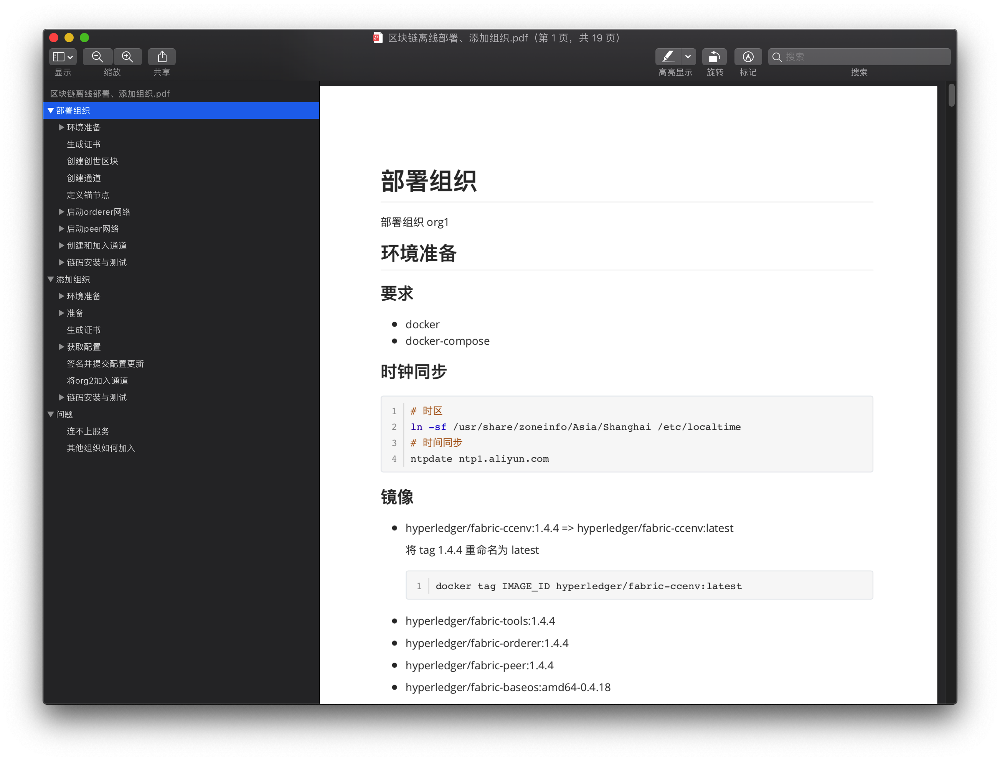

# fabric deploy

> 超级账本 1.4.4 离线部署、添加组织

## 特性

- 离线 docker-compose 部署节点
- 离线增加组织

适合政务内网使用

## 不足

- orderer 节点暂不支持后期添加

## 架构

- 首先部署 3 个 orderer 节点
- 部署组织 org1
- 添加组织 org2
- ...

## 文档

阅读 `docs/区块链离线部署、添加组织.pdf` 操作手册。

## 关于

暂不提供 API 平台（通用上链等），可私聊。
